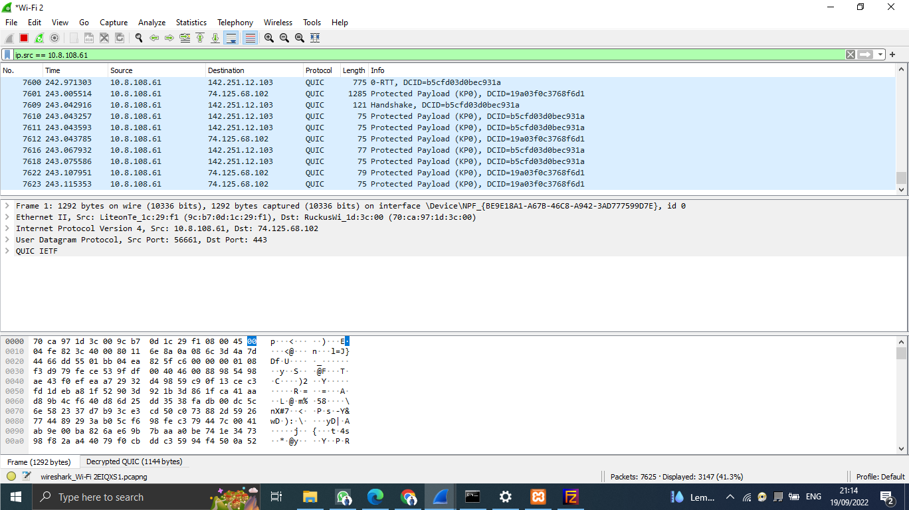

# Laporan Resmi Modul 1 F10 2022

Kelompok F10  
Luthfiyyah hanifah A	  5025201090  
Rachel Anggieuli AP	  5025201263  
Cholid Junoto	        5025201038  

### Soal 1
#### Sebutkan web server yang digunakan pada "monta.if.its.ac.id"!
**Filter**

    'http.request and http.host eq "monta.if.its.ac.id"'

##### Server : ngix/1.10.3

### Soal 2
#### Ishaq sedang bingung mencari topik ta untuk semester ini , lalu ia datang ke website monta dan menemukan detail topik pada website “monta.if.its.ac.id” , judul TA apa yang dibuka oleh ishaq ?
**Filter**

    http

###### Eksport http object dan pilih http

###### Save ke dalam komputer kita

######  Kasih nama dengan type html

###### Lalu kita buka di browser kita akan muncul di browser kita

Didapatkan judul TA Ishaq adalah Evaluasi untuk kerja User Space Filesystem (FUSE)

### Soal 3
#### Filter sehingga wireshark hanya menampilkan paket yang menuju port 80!
**Filter**

    tcp.dstport == 80

### Soal 4
#### Filter sehingga wireshark hanya mengambil paket yang berasal dari port 21!
**Filter** 

    tcp.srcport == 21

### Soal 5
#### Filter sehingga wireshark hanya mengambil paket yang berasal dari port 443!
**Filter**

    tcp.srcport == 443

### Soal 6
#### Filter sehingga wireshark hanya menampilkan paket yang menuju ke lipi.go.id
**Filter**

    tcp contains lipi.go.id

### Soal 7
#### Filter sehingga wireshark hanya mengambil paket yang berasal dari ip kalian!

##### Pertama kita lihat ip kita dengan ketik ipconfig di cdm

###### Setelah muncul kita copy IPv4 Address dan masukkan filter ke wireshark
**Filter**

    ip.src == 10.8.108.61

### Soal 8
#### Telurusi aliran paket dalam file .pcap yang diberikan, cari informasi berguna berupa percakapan antara dua mahasiswa terkait tindakan kecurangan pada kegiatan praktikum. Percakapan tersebut dilaporkan menggunakan protokol jaringan dengan tingkat keandalan yang tinggi dalam pertukaran datanya sehingga kalian perlu menerapkan filter dengan protokol yang tersebut!
**Filter pesan 1**

    tcp.stream eq 12

**Filter pesan 2**

    tcp.stream eq 29

**Filter pesan 3**

    tcp.stream eq 41

**Filter pesan 4**

    tcp.stream eq 90

### Soal 9
#### Terdapat laporan adanya pertukaran file yang dilakukan oleh kedua mahasiswa dalam percakapan yang diperoleh, carilah file yang dimaksud! Untuk memudahkan laporan kepada atasan, beri nama file yang ditemukan dengan format [nama_kelompok].des3 dan simpan output file dengan nama "flag.txt".

### Soal 10
#### Temukan password rahasia (flag) dari organisasi bawah tanah yang disebutkan di atas!

